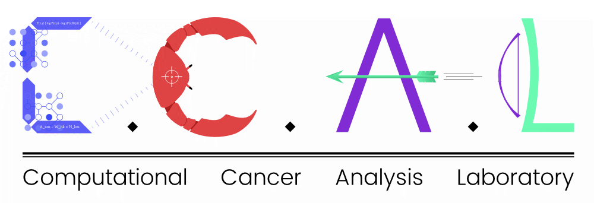

<h1 align="center">
  <br>
  <a href="https://github.com/UCSD-CCAL"></a>
  <br>
  Onco-GPS Paper Analysis
  <br>
</h1>
<h4 align="center">NbPackage for the <a href="http://www.cell.com/cell-systems/fulltext/S2405-4712(17)30335-6" target="_blank">Onco-GPS paper</a> analysis</h4>
<br><br>

This repository contains the Onco-GPS [Notebook Package (NbPackage)](https://github.com/UCSD-CCAL/nbpackage), which is everything you need to reproduce the Onco-GPS paper analysis.

[Watch](https://www.youtube.com/watch?v=Tph5BVYcbUA) how we're making the Onco-GPS Analysis easily accessible.

## Book of analysis
Inside the `notebooks/` directory you'll find 10 notebooks, numbered 0 to 9. Just like chapters in a book, each notebook builds off the previous notebook. So each notebook should be run one after another startting with 0 and ending with 9.

<br><br>
## Reproduce the Onco-GPS paper analysis

### 1. Set up your computer's environment  
#### Requirements: 
  1. python>=3.6
  2. Jupyter Notebook
  3. R and two R packages (rpy2 and r-mass)
  4. biopython. 

#### To get the requirements:

1. Install Anaconda
   * [Watch how](https://youtu.be/xKGaGXmy8j4) or [go here](https://www.continuum.io/downloads)
2. Install R, rpy2, r-mass, and biopython

<a href="https://asciinema.org/a/142193" target="_blank"></a>

### 2. Get the Onco-GPS NbPackage

In Terminal enter:
```
git clone --recursive https://github.com/UCSD-CCAL/onco-gps-paper-analysis.git
```

### 3. Run the notebooks
In Terminal enter:
```sh
jupyter notebook
```
Navigate to the onco-gps-paper-analysis/notebooks directory and begin running the notebooks :smile:

<br><br>
## Feedback
If something's not working or you have questions, comments, or concerns, please [create an issue](https://github.com/UCSD-CCAL/onco-gps-paper-analysis/issues/new).
