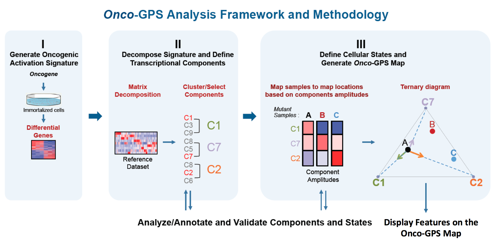

<h1 align="center">
  <br>
  <a href="https://github.com/UCSD-CCAL"></a>
  <br>
  Onco-GPS Paper Analysis
  <br>
</h1>
<h4 align="center">NbPackage for <a href="http://www.cell.com/cell-systems/fulltext/S2405-4712(17)30335-6" target="_blank">Kim et al. Decomposing Oncogenic Transcriptional Signatures to Generate Maps of Divergent Cellular States</a></h4>
<br>

This repository contains the Onco-GPS [Notebook Package (NbPackage)](https://github.com/UCSD-CCAL/nbpackage), which is everything you need to reproduce the Onco-GPS paper analysis.

## Table of Contents
- [Introduction](#introduction)
  - [Analysis Overview](#analysis-overview)
  - [The 9 chapters of the Onco-GPS methodology](#the-9-chapters-of-the-onco-gps-methodology)
  - [Additional notes](#additional-notes)
- [Reproduce the Onco-GPS paper analysis](#reproduce-the-onco-gps-paper-analysis)
- [Feedback](#feedback)

## Introduction

**Authors:** William Kim(1), Huwate (Kwat) Yeerna(2), Taylor Cavazos(2), Kate Medetgul-Ernar(2), Clarence Mah(3), Stephanie Ting(2), Jason Park(2), Jill P. Mesirov(2,3), and Pablo Tamayo(2,3).

1. Eli and Edythe Broad Institute
2. UCSD Moores Cancer Center
3. UCSD School of Medicine

**Date:** April 17, 2017

### Analysis overview

In this series of notebook chapters, we introduce Onco-GPS (OncoGenic Positioning System), a data-driven analysis framework and associated experimental and computational methodology that makes use of an oncogenic activation signature to identify multiple cellular states associated with oncogene activation. In this chapter we will describe the overall method and then we will provide a guide to the remaining chapters. We also provide at the end a guide to download the input datasets.

The Onco-GPS methodology decomposes an oncogenic activation signature  into its constituent components in such way that the context dependencies and different modalities of oncogenic activation are made explicit and taken into account. Once characterized and annotated, these components are used to deconstruct and define cellular states, and to map individual samples onto a novel visual paradigm: a two-dimensional Onco-GPS “map.” This resulting model facilitates further molecular characterization and provides an effective analysis and summarization tool that can be applied to explore complex oncogenic states.


The Onco-GPS approach is executed in 3 major modular steps as shown in the Figure below. 

<div>
    
</div>

Step I involves the experimental generation of a representative gene expression signature reflecting the activation of an oncogene of interest. In step II, the resulting signature is decomposed into a set of coherent transcriptional components using a large reference dataset that represents multiple cellular states relevant to the oncogene of interest. These components are also biologically annotated and characterized through further analysis and experimental validation (see article). In step III, a representative subset of samples and components are selected to define cellular states using a clustering procedure. The selected components are also used as transcriptional coordinates to generate a two-dimensional map where the selected individual samples are projected relative to these transcriptional coordinates in analogy to a geographical GPS system as shown below.

<p align="center">
  
</p>

The Onco-*GPS* map can also be used to display the association of samples with various genomic features, such as genetic lesions, pathway activation, individual gene expression, genetic dependencies and drug sensitivities. We will use the Onco-*GPS* approach to explore the complex functional landscape of cancer cell lines with alterations in the RAS/MAPK pathway. 


### The 9 chapters of the Onco-GPS methodology

Before executing these notebooks make sure you download the input datasets as described in the section at the end of this notebook.

__Chapter 1: Set up data__
  * This chapter downloads data that was too large to put on GitHub, populating data/ directory and leaving the directory with all input data needed for the following analyses.

__Chapter 2: Generate oncogenic-activation signature__
  * This chapter shows how to generate the oncogenic signature (step 1 above). This is useful if one is interested in creating an Onco-GPS map for a given oncogene (for which one has a dataset or at least a gene set representing its activation).

__Chapter 3: Decompose oncogenic-activation signature and define transcriptional components__
  * This chapter shows how to take the oncogenic signature from chapter 1, or any other signature or gene set of interest, and decomposed it into transcriptional components using Non-Negative Matrix Factorization (NMF).

__Chapter 4: Annotate transcriptional components__
  * This chapter annotates, or characterizes, the transcriptional components found in chapter 2 by matching many types of genomic features to the component profiles (i.e. the rows of the "H" matrix generated in chapter 2). The full results sets produced by this analysis are also stored under the directory "../results" in subfolder: component_annotation.

__Chapter 5: Define cellular states and make Onco-GPS map__
  * This chapter defines the oncogenic states by clustering the KRAS mutant subset of  the "H" matrix obtained in chapter 2. It also defines a triangular or ternary Onco-GPS map using components C1, C7 and C2, and then projects the KRAS mutant samples on it.

__Chapter 6: Annotate cellular states__
  * This chapter is similar to chapter 3 but it annotates and characterizes the oncogenic states defined in chapter 4. The full results sets produced by this analysis are also stored under the directory "../results" in subfolder: state_annotation.

__Chapter 7: Display genomic features on Onco-GPS map__
  * This chapter displays selected genomic features of interest on the KRAS mutants Onco-GPS map including gene, protein and pathway expression, mutations, tissue types etc.

__Chapter 8: Define global cellular states and make global Onco-GPS map__
  * This chapter defines the global oncogenic states (S1-S15) and corresponding Onco-GPS map using all the KRAS components (C1-C9) defined in chapter 2.

__Chapter 9: Display genomic features on global Onco-GPS map__
  * This chapter displays selected genomic features of interest on the global Onco-GPS map including gene, protein and pathway expression, mutations, tissue types etc.

### Additional notes

*  To reproduce the entire analysis one runs the 9 chapters in sequence. If one is interested in applying the methodology to a different oncogene, one would start by generating the oncogenic signature (chapter 2) using an appropriate dataset e.g. one that you generate in your laboratory, one taken from the literature, or a relevant gene set.      

* If one is interested  in exploring the original KRAS mutant or the global Onco-GPS presented in the article, e.g. display your favorite gene mRNA or mutations status, you would go directly to chapters 7 or 9 and modify these chpaters to display the gene or feature of interest.      

* The chapters (notebooks) are organized as a [Notebook Package](https://github.com/UCSD-CCAL/nbpackage)

* The analysis in most chapters will run in under a couple of hours of computer execution time. However, because chapters 4 and 6 execute a full annotation sweep using all components and all states against many datasets of genomic features they could take a few days of computer time to execute.

## Reproduce the Onco-GPS paper analysis

### 1. Set up your computer's environment  
#### Requirements: 
  1. python>=3.6
  2. Jupyter Notebook
  3. rpy2, r-mass, biopython

#### To get the requirements:

1. [Install Anaconda](https://youtu.be/xKGaGXmy8j4) or [go here](https://www.continuum.io/downloads)
2. [Install rpy2, r-mass, and biopython](https://asciinema.org/a/142193)

### 2. Get the Onco-GPS NbPackage

In Terminal enter:
```
git clone --recursive https://github.com/UCSD-CCAL/onco-gps-paper-analysis.git
```

### 3. Run the notebooks
In Terminal enter:
```sh
jupyter notebook
```
Navigate to the onco-gps-paper-analysis/notebooks directory. Inside the `notebooks/` directory you'll find 9 notebooks, numbered 1 to 9. Just like chapters in a book, each notebook builds off the previous notebook. So each notebook should be run one after another startting with 1 and ending with 9.

## Feedback
If something's not working or you have questions, comments, or concerns, please [create an issue](https://github.com/UCSD-CCAL/onco-gps-paper-analysis/issues/new). We'll get back to you in one business day :smile:
